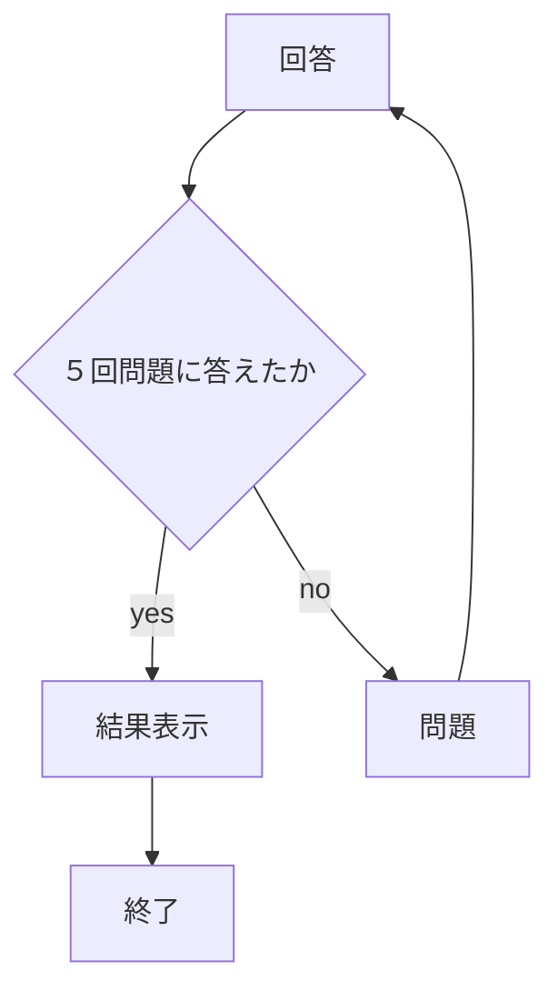
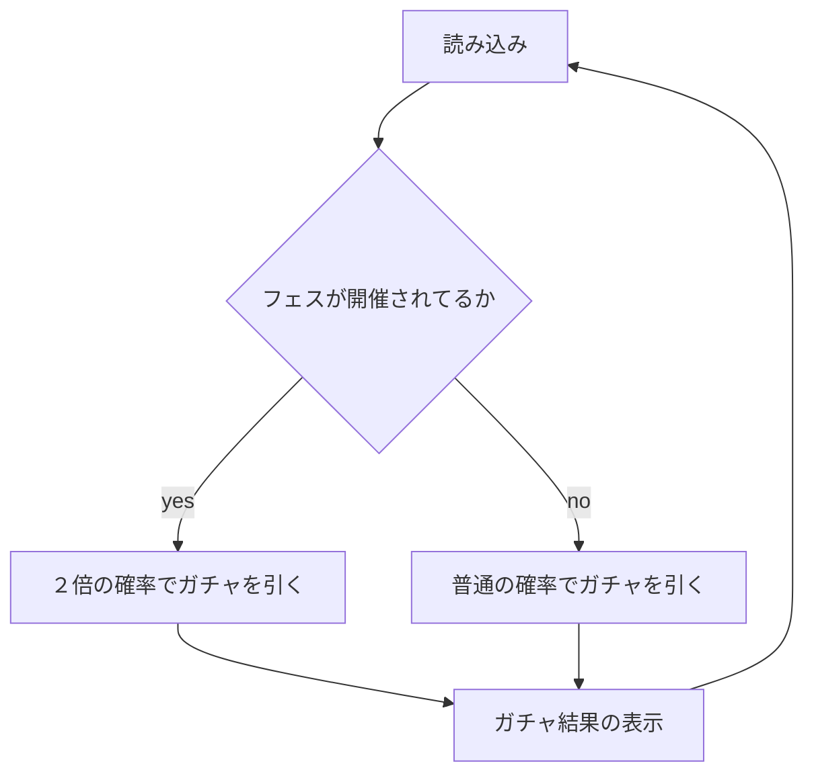

# webpro_06
※このマークダウンにはジャバスクリプトのファイルapp5.jsについては書かれているが，そのなかで出てくるGETリクエストが/nazoパス・/gatyaパスに送られたときに必要になるnazo.ejsとgatya.ejsに付いての記載はないので注意する．
ウェブブラウザにおいて様々な機能を持たせるためにファイルを作成した．
今回はサーバサイドとクライアントサイドのプログラミング言語にJavaScript，サーバサイド実行環境にnode.js，クライアントサイドの実行環境にGoogle，クラウドサービスにGithubを用いる．

## app5.js
ファイル名 | 説明
-|-
app5.js | プログラム本体

サーバーサイドの処理が書かれている．

###　前提設計

1. const express = require("express");とあるがこれはウェブフレームワークであるexpressを関数requireで呼び出して，変数expressに代入している．
1. const app = express();これはexpress()によりExpressアプリケーションのオブジェクトが返され，そのオブジェクトにはアプリケーションを構成するためのさまざまなメソッドやプロパティが含まれている．それをappに代入することでこれから先Expressに関する設定やルーティング，サーバーの起動などを行う．
1. app.set('view engine', 'ejs');によりビューエンジンにejsを用いることを定義づけ，動的なHTMLコンテンツの作成を可能にした．
1. app.use("/public", express.static(__dirname + "/public"));はapp.useによりミドルウェアを設定することができ，"/public"によりブラウザでアクセスする際のURLパスを示す．express.static(__dirname + "/public")により/publicフォルダーの中身が静的ファイルとしてミドルウェアに渡される．__dirnameにより今の実行中のJavaScriptファイルが存在するディレクトリの名前が格納されている．

### app.get("/nazo)
これはウェブ上で出された５問の問題に対し答えを手動で入力し正否を問う簡単なクイズの設計だ．
app.get("/nazo", (req, res)によりウェブ上でのアドレスはhttp://localhost:8080/nazo
となる．なぜ8080なのかは「httpサーバーの起動のためのExpress」を参照してほしい．
numに１〜１０の数字をランダムに割り振りその数字に合わせてcpuに格納された１０個のナゾを設定する．kotaeに入力された回答と問題とを照らし合わせ，もし正解したら変数seikaiに数を+1する．そして変数judgementに正解と代入．もし不正解なら変数judgementに不正解と代入．問題が終わるとtotalの総問題数に+1される．
cpu,kotae,judgement,seikai,totalをレンダリングする．
totalの数が５に達した場合問題の表示を終了し，レンダリングされたcpu,kotae,judgement,seikai,total,'これで終了です！もう一度挑戦してみてください！'と入力された変数commentを返り値としてnazo.ejsに渡す．

req.query.によりクエリパラメータとして送られた解答（kotae），正解数（seikai），総問題数（total）を取得する．
console.log({ kotae, seikai, total});によりデバック用にコンソールにも解答（kotae），正解数（seikai），総問題数（total）を表示する．

### app.get("/gatya")
ウェブ上でこの/gatyaを開くとその瞬間に今ガチャがフェス(当たり確率２倍)を開催しているのかとガチャを引いた結果が表示される．
まずgtyとfesを初期化し，gtyには引いた結果のレアリティを代入し，fesにはフェスが開催されてるかどうかが入力される．変数numと変数nummにそれぞれランダムな１〜１０００と１〜２の数を代入し，nummをif文で分け，フェスが開催されてるかどうかの設定をし，numで今回引いたレアリティが何なのかをgtyに代入する．
console.log('今回のレアリティは' + gty + 'です');によりコンソールに引いた結果を表示する．
res.render('gatya', { number: num, gty: gty ,numm: numm ,fes: fes});
});によりレンダリングした変数をejsファイルにわたす．
app.get("/gatya", (req, res)によりウェブ上のアドレスはhttp://localhost:8080/gatya
となる．なぜ8080なのかは「httpサーバーの起動のためのExpress」を参照してほしい．

### httpサーバーの起動のためのExpress
app.listen(8080, () => console.log("Example app listening on port 8080!"));によりサーバー受付ポート番号を8080にし，サーバーが正常に起動した際にコンソールに"Example app listening on port 8080!"というメッセージが表示される．
## 起動について
ターミナル上でapp5.jsのあるテーブルに移動し， node app5.jsと入力し実行するとサーバーが建てられる．ただしapp5.js内で定義した変数をnazo.ejsもしくはgatya.ejs内で使用していないとエラーが起きるので注意する．
## ウェブ上のurlについて
すでに記載した通り，ガチャを引きたい場合は
http://localhost:8080/gatya
と入力し，クイズゲームをしたい場合は
http://localhost:8080/nazo
と入力する．そうすればサーバーが建てられている限りはウェブから接続できる．
### Github上での管理について
バージョン管理システムとしてGithubを用いている．
https://github.com/24g1098/webpro_06
のリンク先に飛ぶとapp5.jsの変更点や仕様の確認ができる．
その際わたしが変更点を追加するためにはまずapp5.jsのあるテーブルに移動し，ターミナル上で
git add .
と実行しその後
git commit -am 'コメント'
と実行し（コメントの部分には好きな文字を入力する）変更を加えたファイルに印をつけその後
git push
で変更点を加えた．url先に飛べば変更点を加えたファイルには印がついているはずだ．

11/18
                                                                                                                                                                                                                                                                                                                                                                                                                                                                                                                    