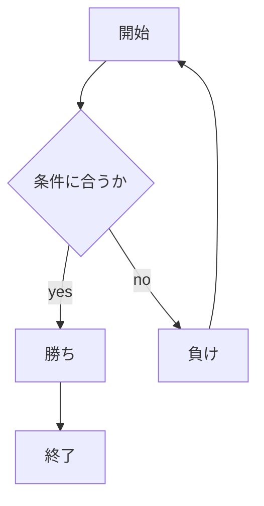

# webpro_06
## このプログラムについて
ファイル名 | 説明
-|-
app5.js | プログラム本体
public/janken.html | じゃんけんの開始画面

## ファイル一覧

10/29
                                                                                                                                                                                                                                                                                                                                                                                                                                                                                                                    