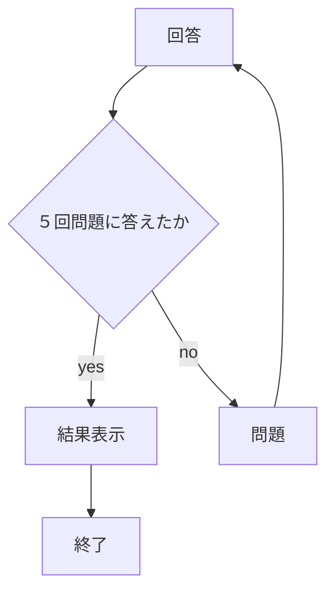
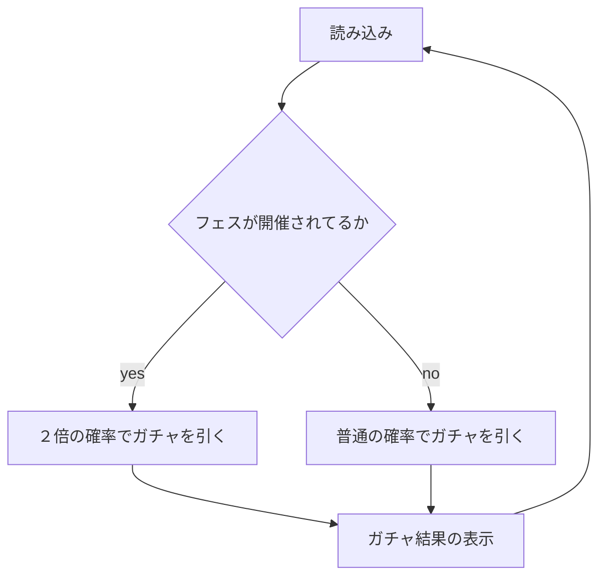

# webpro_06
ウェブブラウザにおいて様々な機能を持たせるためにファイルを作成した．
今回はサーバサイドとクライアントサイドのプログラミング言語にJavaScript，サーバサイド実行環境にnode.jsを用いた．

### ファイル一覧
ファイル名 | 説明
-|-
app5.js | 入力されたデータを処理するプログラムの集まったプログラム．
views/show.ejs | 挨拶を表示する．
views/icon.ejs | Appleのロゴを表示する．
views/luck.ejs | 運勢を表示する．
views/janken.ejs | じゃんけんをした際のサーバーの手と勝敗結果を表示する．
views/nazo.ejs | なぞなぞの問題文と正解かどうかを表示する．
views/gatya.ejs | どんな当たりが出たのかと，引いたガチャが当たりやすいかどうかが表示される．


###　前提設計


1. ウェブフレームワークを```express```にする．
1.Expressアプリケーションのオブジェクトにはアプリケーションを構成するためのさまざまなメソッドやプロパティが含まれている．それを```app```に代入することでこれから先Expressに関する設定やルーティング，サーバーの起動などには```app```を用いて行う．
1. ビューエンジンにejsを用い，動的なHTMLコンテンツの作成を可能にした．
1. ミドルウェアを設定した．ブラウザでアクセスする際は```public```フォルダーへのURLパスを通し，```public```フォルダーの中身が静的ファイルとしてミドルウェアに渡される．

## 起動について
ターミナル上でapp5.jsのあるテーブルに移動し
```node app5.js```
と入力し実行するとサーバーが建てられる．
サーバー受付ポート番号を8080にし，サーバーが正常に起動した際にコンソールに```"Example app listening on port 8080!"```というメッセージが表示される．
## app5.js
前述より，サーバーへのアクセスは以下のようなurlを入力することになる．
```http://localhost:8080/???```
以下図に```???```に何を入力するかによる機能をまとめる．
？？？にいれる名前 | 説明
-|-
/hello1 | 挨拶の表示
/hello2 | 挨拶の表示
/icon | Appleのロゴの表示
/luck | 運勢の表示
/janken | コンピューターとじゃんけん
/nazo | なぞなぞが出されるからユーザーが解くことができる
/gatya | ガチャを引きレア度を確認できる

```app5.js```の中には```???```に```/hello1```，```/hello2```，```/icon```，```/luck```，```/janken```，```/nazo```，```/gatya```が入った場合のプログラムが書かれており，次章からはその中身を一つ一つ説明していく．
### 挨拶を表示するプログラム１
urlは```http://localhost:8080/hello1```であり機能としては
```挨拶1：Hello world```
```挨拶2：Bon jour```
と表示されるように，```show.ejs```ファイルに渡す変数(```greet```)に渡す変数(```message```)に```Hello world```，```Bon jour```を代入する．
### 挨拶を表示するプログラム2
urlは```http://localhost:8080/hello2```であり機能としては
```挨拶1：Hello world```
```挨拶2：Bon jour```
と表示されるように，```show.ejs```ファイルに渡す変数(```greet```)に```Hello world```，```Bon jour```を代入する．ただしこちらは```挨拶を表示するプログラム１```と違い```message```を途中で挟んでいない分，汎用性が落ちる．
### Appleロゴを表示するプログラム
urlは```http://localhost:8080/icon```であり機能としては
Appleロゴを表示するために```/public```ファイルにパスを通し，Appleのロゴの画像を表示する．
### 運勢を表示するプログラム
urlは```http://localhost:8080/luck```であり機能としては
１〜６のランダムな数字を割り振り，１には大吉，２には中吉を代入してある．１〜６の数字をランダムで```luck.ejs```に渡し，運勢を表示する．その際４〜６には運勢を割り振っていないため運勢は表示されない．
### コンピューターとじゃんけんするプログラム
urlは```http://localhost:8080/janken```であり機能としては
クライアント側はカタカナの```グー```・```チョキ```・```パー```のどれかしらの手を入力し，サーバーからもグー・チョキ・パーのどれかが選ばれるので，一人でじゃんけんができ，じゃんけんの勝敗結果を表示することができる．
### なぞなぞを解くプログラム
urlは```http://localhost:8080/nazo```であり機能としては
サーバー側で用意した５つの問題をクライアントに解いてもらい正解であれば正解数を記録し，最終的な正解数を表示する．答えに一致してるかの判断にはすでに入力してある答えのどれかしらに一致してるかで判断する．５問答え終わると```これで終了です！もう一度挑戦してみてください！```と表示される．デバック用にコンソールにも解答，正解数，総問題数，を表示する．



### ガチャを引くプログラム
urlは```http://localhost:8080/gatya```であり機能としては
今現在当たり確率が２倍かどうか判断する．
そしてガチャの結果を表示する．大当たりは1/1000であり当たりは1/10，ノーマルは2/5，ハズレは1/2である．



## ウェブ上のurlについて
すでに記載した通り，挨拶を見たい場合は
http://localhost:8080/hello1
と入力し，挨拶を見たい場合は
http://localhost:8080/hello2
と入力し，Appleのロゴを見たい場合は
http://localhost:8080/icon
と入力し，自分の運勢を見たい場合は
http://localhost:8080/luck
と入力し，場合は一人でじゃんけんしたい場合は
http://localhost:8080/janken
と入力し，ガチャを引きたい場合は
http://localhost:8080/gatya
と入力し，クイズゲームをしたい場合は
http://localhost:8080/nazo
と入力する．そうすればサーバーが建てられている限りはウェブから接続できる．
### Github上での管理について
バージョン管理システムとしてGithubを用いている．
https://github.com/24g1098/webpro_06
のリンク先に飛ぶとapp5.jsの変更点や仕様の確認ができる．
その際わたしが変更点を追加するためにはまずapp5.jsのあるテーブルに移動し，ターミナル上で
```git add .```
と実行しその後
```git commit -am 'コメント'```
と実行し（コメントの部分には好きな文字を入力する）変更を加えたファイルに印をつけその後
```git push```
で変更点を加えた．url先に飛べば変更点を加えたファイルには印がついているはずだ．


2024年
12/13
                                                                                                                                                                                                                                                                                                                                                                                                                                                                                                                    